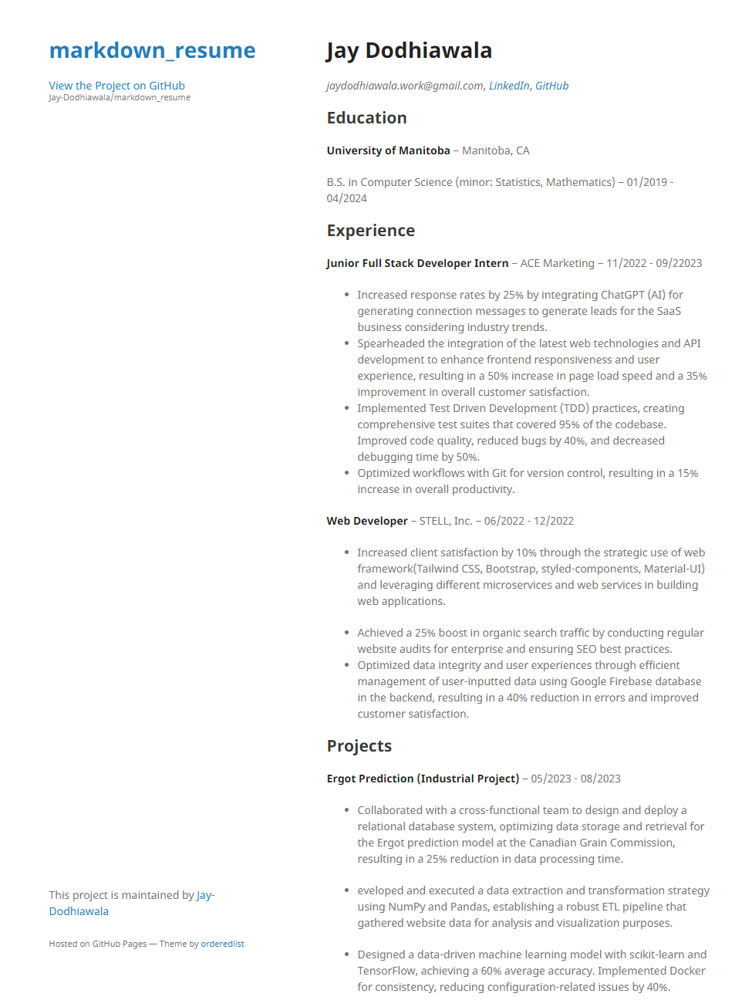

# Markdown Resume

Welcome to my GitHub repository! This is where I host my resume, which is built using Markdown and hosted on GitHub Pages.

# Hi, I'm Jay! 👋

## 🚀 About Me.

I am completing my Bachelors in Computer Science with minor in Statistics and Mathematics from the **University of Manitoba**. I am a skilled Developer with a passion for leveraging cutting-edge technologies to drive innovation and enhance user experiences. With over two years of experience in web development and software engineering, I bring a unique blend of technical expertise and creativity to every project. I am adept at integrating AI solutions, optimizing performance, and implementing best practices to deliver impactful results. I am currently seeking opportunities to further develop my skills and contribute to innovative projects in a collaborative environment.

## Documentation.

This repository contains my Markdown resume and all the resources along with instructions on how to view it hosted and source code.

- **source code:** open `index.md`
- **theme:** go to `_config.yml` (using minimal theme from Jekyll right now)
- **screenshot:** open `ss.png`
- **hosted version:** [click me](https://jay-dodhiawala.github.io/markdown_resume/) 🎉

## Screenshots.

## 🛠 Skills and Interests.

#### Programming Language

- Python, Java, JavaScript, HTML/CSS, TypeScript, C/C++, R, SQL

#### Developer Tools

- Visual Studio, Vs code, Jupyter, Android Studio, JIRA, IntelliJ IDE, MySQL, Linux/Unix, Git/GitHub/GitLab, Docker, Kubernetes, Postgres, MongoDB, PostgreSQL, ChatGPT

#### Intrests

- Machine Learning, IoT, System Architecture

## FAQ

#### 1. How can I view your resume

You can view my resume by visiting this _[link](https://jay-dodhiawala.github.io/markdown_resume/)_. Alternatively, you can view the Markdown file in `index.md.`.

#### 2. How can I contact you for opportunities?

You can reach out to me via email at [Email Address](mailto:jaydodhiawala.work@gmail.com) or connect with me on social media platforms such as [LinkedIn](https://linkedin.com/in/jaydodhiawala).

## 🔗 Links

<!--  -->

<!--  -->
