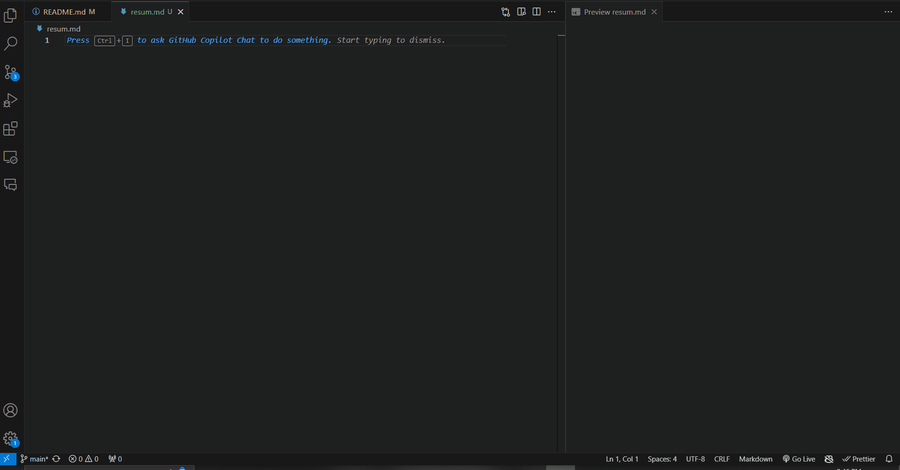
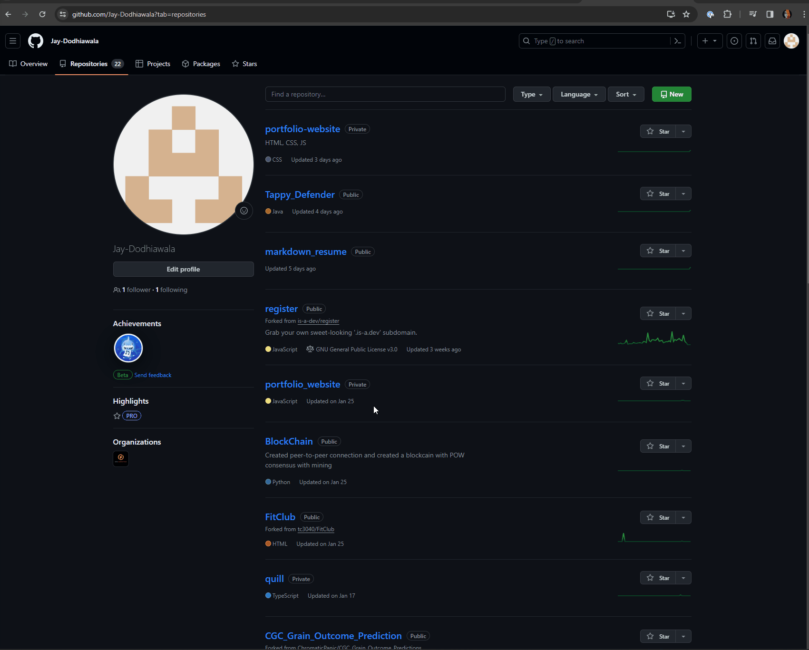
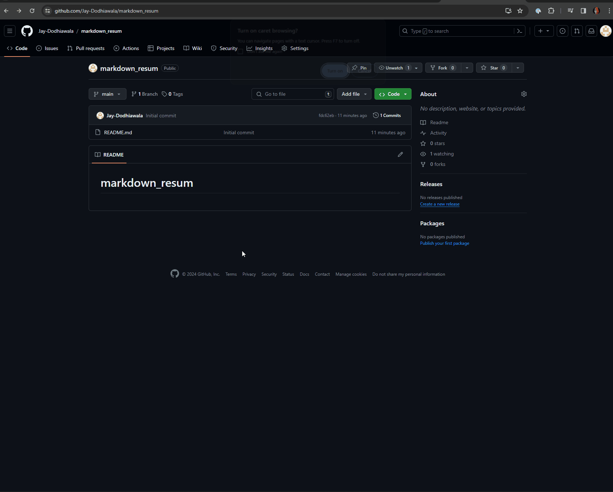
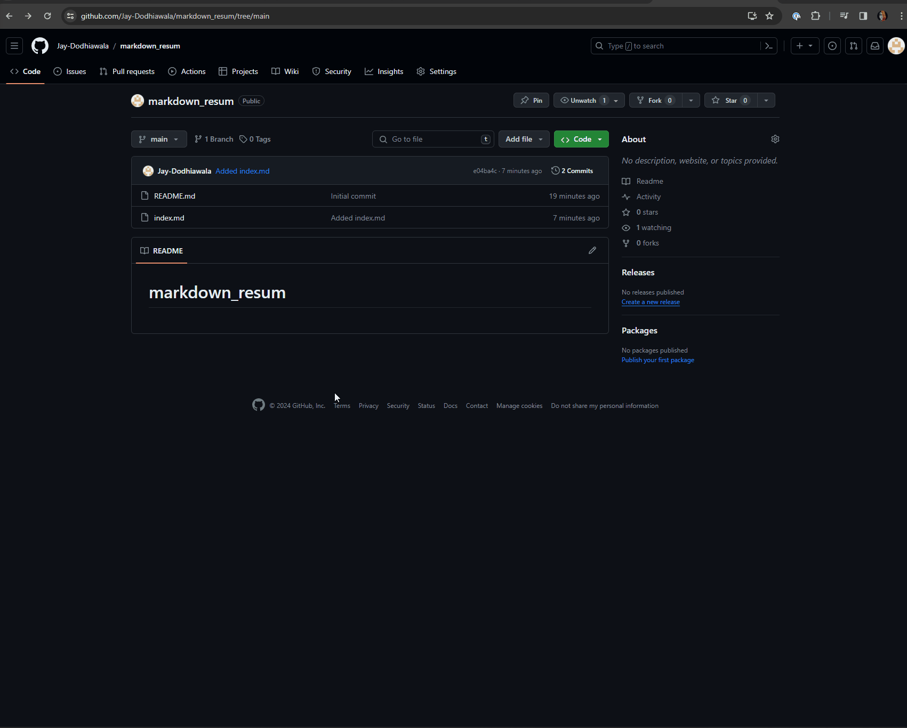
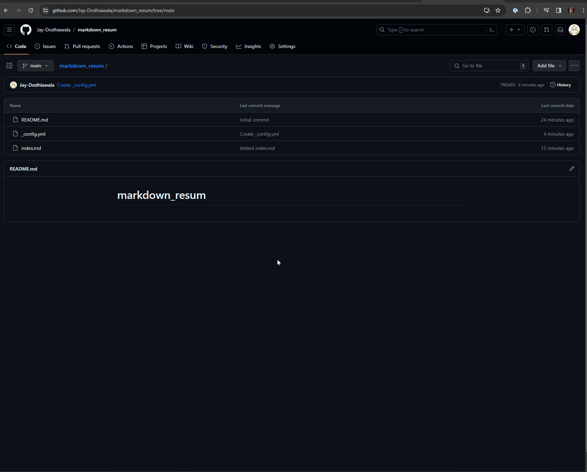
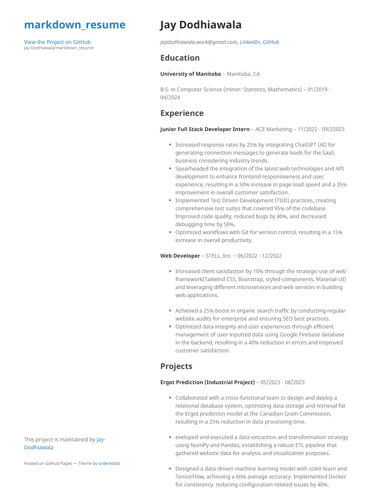

# How to Host Markdown Resume.

## Purpose.

This guide is going to help in creating and showcasing the resume on a static website using different tools. This resume file will be written in Markdown, therefore you will need a Markdown editor to produce it, as well as a GitHub page to host it and Jekyll to format it. This will also include the principles and ideas presented in Andrew Etter's book Modern Technical Writing, in which we will apply step-by-step tutorials on how to create, format, and host your resume.

## Prerequisites.

These are the requirements to follow the step-by-step instructions for this project:

- **Markdown Editor -** You will required a markdown editor like [Markdown Pad](http://www.markdownpad.com/) which is suggested by Andrrew Etter in the book. But it is not limited to Markdown Pad as you can use any markdown of your choice to showcase that we will use [VS Code](https://code.visualstudio.com/) editor for this project.
- **Your Markdown Resume -** You would have to create your resume in light-weight markup language preferably Markdown as it is simple and widely used using any Markdown Editor. Visit this [link](https://www.markdowntutorial.com/) for the tutorial on Markdown.
- **GitHub Account -** You would require a [github](https://github.com/?ef_id=_k_EAIaIQobChMIn7L4t9LjhAMVvYzCCB0ZnwBEEAAYASAAEgL85PD_BwE_k_&OCID=AIDcmmli8vlwie_SEM__k_EAIaIQobChMIn7L4t9LjhAMVvYzCCB0ZnwBEEAAYASAAEgL85PD_BwE_k_&gad_source=1&gclid=EAIaIQobChMIn7L4t9LjhAMVvYzCCB0ZnwBEEAAYASAAEgL85PD_BwE) account where you can create, store, manage your resume online. GitHub is a version control platform which is widely used by developers to store, and collaborate on the code/project.
- **Jekyll -** [Jekyll](https://jekyllrb.com/) renders a markdown file adds a theme to it and produces a completely static website ready to be served.

## Instructions.

### 1. Make a Resume in Markdown.

To create a professional resume locally for hosting on a static website, we'll utilize a lightweight markup language. Markdown, being one of the most widely used lightweight markup languages, aligns perfectly with our goals. By employing Markdown, we adhere to Andrew Etter's principle of simplicity and accessibility, as outlined in his book "Modern Technical Writing."

**Note - Your resume file name should be `index.md`_(this is an important step)_.**

### 2. Create a GitHub Account.

GitHub is widely regarded as one of the most popular Distributed Version Control Systems (DVCS) on the market. Using DVCS such as GitHub keeps track of all the versions of the project and makes it available allowing users to quickly repair errors or make modifications. Etter emphasizes the benefits of using DVCS, claiming that it improves speed and is better for simultaneous collaboration on the same project. Furthermore, developers favour DVCS, making it necessary for technical writers to use them.

You can sign up for a GitHub.com account by following the prompt in this [link](https://github.com/).

### 3. Create a New Repository on GitHub.

After creating the GitHub account you will have to create your first repository and name it accordingly make it public or private _(for this project I am making it public)_.

### 4. Adding files in your Repository.

After creating your repository you have to add your markdown resume `index.md` in this repository add a commit message and then commit changes.

### 5. Add Jekyll theme on `index.md`.

We will use Jekyll to add them to the resume. To do that we will have to create a new file called `_config.yml` for the repository. And add the following line of code in that file `theme: jekyll-theme-minimal`. This makes it easier to create a professional-looking website without having to manually design and style each page.

If you would like to choose a different theme navigate to this https://jekyllrb.com/docs/themes/

### 6. Now we host it on GitHub Pages.

Now to host this on GitHub Pages we need to make some changes in the setting of this repository. So follow the steps mentioned below:

1. Go to the settings of the repository.
2. Click on Pages.
3. Under the branch section choose `main` as a branch.
4. Click save.
   **NOTE - Give it some time to process _(around 1 minute)_**

A hosted version of your resume can be seen on `https://yourusername.github.io/reponame` in general. For this repository `yourusername = jay-dodhiawala` and `reponame = markdown_resume` so the whole URL looks like this `https://jay-dodhiawala.github.io/markdown_resume/` or [click here](https://jay-dodhiawala.github.io/markdown_resume/).

## Screenshot and Demo.

## More Resources.

- **Markdown Tutorial -** [Markdown Tutorial](https://www.markdowntutorial.com/) is an easy to go through step-by-step guide to learn markdown.
- **Awsome Readme -** [Awsome Readme](https://github.com/matiassingers/awesome-readme) consist of beautiful README examples that include but are not limited to: images, screenshots, GIFs, text formatting, etc.
- **Modern Technical Writing by Andrew Etter -** This [book](https://www.amazon.ca/Modern-Technical-Writing-Introduction-Documentation-ebook/dp/B01A2QL9SS/ref=sr_1_1?dib=eyJ2IjoiMSJ9.h9LxOHmOAnlvUGYcvhTL4ClLhGKIJwiB_lxBPHU2x73a8KJVgRGqGjZZRm669cJwejA3DmqH8TxsB9nuVGltxUgzowQdjpfpBHlx7yCEiJji_YKyzLPICWhwmpc76_eOwcn8jPEcHI8b6suuUzhHVEY0CJI8khrWw9xhUnC5qTZv1Gx30ODfAGUcJ4pk7DCkPPhFwBCRLtNrPmmXVGpYdmZfyagM61QIlXvxQUOo9R9sfq1Ahtpt33dTvdkMLZ17nxs4MAJ1E8VTXIl13nzoF3hiUvWCtfN5cxv990dBZsg.Umk8Pn_0fgn6ghXjAFLY8hGkJKEW9m-GSpWnW1GY0ik&dib_tag=se&hvadid=671272763676&hvdev=c&hvlocphy=9001212&hvnetw=g&hvqmt=e&hvrand=7483445791036939457&hvtargid=kwd-316052970931&hydadcr=22459_13497880&keywords=modern+technical+writing&qid=1709844831&sr=8-1) showcases the streamlined approaches to technical documentation for today's digital age using a light-weight markup language.

## Authors.

- [@Jay dodhiawala](https://github.com/Jay-Dodhiawala)

## Acknowledgements.

- **Neel Kakadiya -** Readme Peer reviews
- **Arshpreet Buttar -** Readme Peer Review
- **Brian lie -** Readme Peer Review

**Special thanks to Andrew Etter for his invaluable insights in Modern Technical Writing.**

## FAQ.

#### 1. Why is Markdown better than a word processor?

According to Andrew Etter, "Documentation with any sort of lifespan needs to be kept in version control, which Word's DOCX file format (a compressed collection of XML files) actively opposes." Using Markdown helps two principles mentioned by Etter in use

- To Deploy the documentation using a static site generator
- To Store the document under version control.

#### 2. Why is my resume not showing up?

According to Etter, "DVCS have better performance, allow for offline work, and are superior for concurrent work on the same file. For technical writers, the most important reason to use DVCS is that developers prefer them." Hence, the usability of DVCS can be proved in the long run where multiple users commit and update a project. DVCSC can handle that kind of structure and keep the documentation secure.

## 🔗 Social Links.

